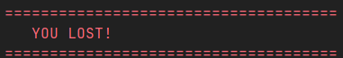
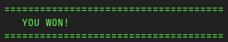

# DAI-Practical-work-2

```
    _   __      __                       
   / | / /___  / /_____  ____ ___  ____  ____ 
  /  |/ / __ \/ //_/ _ \/ __ `__ \/ __ \/ __ \
 / /|  / /_/ / ,< /  __/ / / / / / /_/ / / / /
/_/ |_/\____/_/|_|\___/_/ /_/ /_/\____/_/ /_/

```




## Table of contents
- [Authors](#authors)
- [Overview](#overview)
- [Game rules](#game-rules)
- [Features](#features)
- [Usage](#usage)
- [Docker version](#docker-version)
- [Implementation](#implementation)
- [Contribute](#contribute)

## Authors

- [Fabien Léger](https://github.com/Schokiiiiiiii)
- [Samuel Dos Santos](https://github.com/Samurai-05)

## Overview

This repository contains the second practical work. The goal is to create a client-server application.
The application runs the *Nokenet* protocol
We chose to create a small turn-based CLI game called 
***Nokemon***. The game is composed of a single `.jar` file that can be launched either as a server or a player client.

Information about the *Nokenet* protocol can be found [here](docs/application-protocol.md).

## Game Rules

- Each player controls a Nokemon with 80 HP
- Players take turns choosing actions:
    - **ATTACK**: Deals a random amount of damage to opponent
    - **HEAL**: Restores a random amount of HP (max 80)
- The first player to reach 0 HP loses

## Features
- Turn-based combat system
- Real-time game state synchronization
- Input validation and error handling
- Handle a client disconnecting mid-game

## Usage

### Clone the repository

- `git clone https://github.com/Schokiiiiiiii/DAI-Practical-work-2.git`

### Package the application

#### IntelliJ IDEA

In IntelliJ IDEA, you can open the project and use run button with the `Package application as JAR file` to package the application.

#### Otherwise

You can also use the following command to package the application at the root of the project:
```Bash
./mvnw dependency:go-offline clean compile package
```
#### Errors

In case of an error, try running the `mvn install command`.

### Run the application

#### Server

Default port and host (localhost:7270)

```Bash
java -jar target/java-tcp-programming-1.0-SNAPSHOT.jar server
```

Specify port

```Bash
java -jar target/java-tcp-programming-1.0-SNAPSHOT.jar server -p=<port>
```

The server will automatically start listening for incoming 
connections. It will also display 
some logs describing what is happening.

#### Client

Default host (localhost:7270)

```Bash
java -jar target/java-tcp-programming-1.0-SNAPSHOT.jar client
```

Specify host and port

```Bash
java -jar target/java-tcp-programming-1.0-SNAPSHOT.jar client -H=<host> -p=<port>
```

##### Example

```
Enter your username > P2

=== Lobby Menu ===
1. CREATE - Create a new game
2. JOIN - Join existing game
3. QUIT - Exit
Choose an option > 56
Invalid option, try again.

=== Lobby Menu ===                                                                       
1. CREATE - Create a new game
2. JOIN - Join existing game
3. QUIT - Exit
Choose an option > 2    

Joining game...

====Current Game Status====
P2 (You): 80 HP
P1: 80 HP
===========================

    Your Turn    
1. ATTACK - Attack opponent
2. HEAL - Heal your Nokemon
Choose an option > 1
...             
```

## Docker version

### Run our application in a docker container

Create a docker network
```Bash
docker network create nokemon-net
```

Run server
```Bash
docker run --name nokemon-server \
    --network nokemon-net \
    ghcr.io/schokiiiiiiii/dai-practical-work-2:nokemon-latest \
    server
```

Run client
```Bash
docker run -it \
    --network nokemon-net \
    ghcr.io/schokiiiiiiii/dai-practical-work-2:nokemon-latest \
    client -H=nokemon-server
```

Remove the server
```Bash
docker rm nokemon-server
```

### Build and publish your own docker image

Build docker image
```bash
docker build -t IMAGE_NAME .
```

Check image got built
```bash
docker images | grep IMAGE_NAME
```

Tag your new build
```bash
docker tag IMAGE_NAME ghcr.io/YOUR_USERNAME/YOUR_REPOSITORY:IMAGE_NAME-latest
```

Log in to GHCR
```bash
echo YOUR_GITHUB_PAT | docker login ghcr.io -u YOUR_USERNAME --password-stdin
```

Push to GHCR
```bash
docker push ghcr.io/YOUR_USERNAME/YOUR_REPOSITORY:IMAGE_NAME-latest
```

More information about how to authenticate to the GitHub Container Registry can be found [here](https://docs.github.com/en/packages/working-with-a-github-packages-registry/working-with-the-container-registry#authenticating-to-the-container-registry).

## Implementation

### Architecture

We implemented an MVC like architecture with a network 
layer, a view layer (client only) and a controller layer.

This way it was easier to separate the logic into different classes
that each have their own responsibilities.

This also allows laying out a basic structure for the future 
development of the application by making it easier to add new 
features.

### Network layer

We used the Java virtual threads to handle the communication with multiple clients.
We think this is the most efficient way to handle multiple connections and sockets.

### Limitations

- The server can only handle one game at a time (maximum 2 players concurrently). Multiple clients can connect to the server, but they will not be able to join a game. 

## Contribute

Feel free to contribute to this project. </br>
Please open an issue before submitting a pull request.</br>
Only signed commits will be accepted, more information [here](https://docs.github.com/en/authentication/managing-commit-signature-verification/signing-commits).
