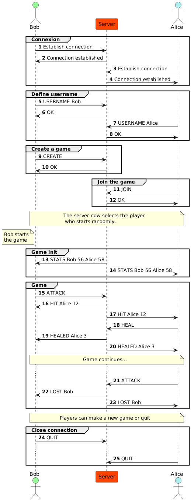
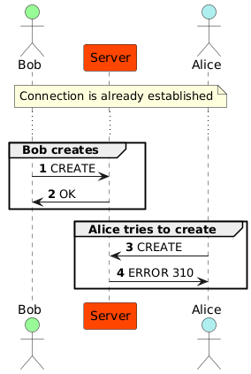

# Application Protocol

## General

- Authors: Fabien Léger & Samuel Dos Santos
- Course: DAI, HEIG-VD

## Overview

The Nokemon Internet Protocol (NOKENET) is an interaction protocol for the video game Nokemon.
It allows users to send actions to the server to interact with the game in a 1 player vs 1 player environment.

A user can also be called player or trainer.

Each player has one single Nokemon. A Nokemon is an animal players use to fight each other. When fighting each other,
a trainer can either ask its Nokemon to attack the other Nokemon or to heal itself. The game is turn-based.

## Transport protocol

The NOKENET protocol is an action based message protocol. It must use the TCP (Transmission Control Protocol) to have
reliability over the network but also have a more connection based protocol. It must use the port 7270.

Each action must be encoded in UTF-8 and delimited by a newline character (`\n`). Each action must be read as a command
like one in a command-line application or an old RPG video game.

The server must be online for NOKENET to work.

The client will establish the initial connection. In case there are already two players on the server, the
server will refuse the connection.

Once the client has established the connection, it will be asked to choose a trainer name. This name will be unique. In
case the name is already taken, the server will send and error.

After that, the server will confirm the name and let the client go through. The client can now either:

- Start a new game
- Join an existing game
- Quit

If the player starts a new game, the server will wait for someone else to join the game. If there is already an existing
game, the client cannot create a new one.

Joining a game will join automatically if a game already exists.

Quitting will close the connection between the client and the server.

Once someone joins the game, the player that will start the game will be chosen randomly.

A player has two possibilities while in a game:

- Attack the other player's Nokemon, reducing his health points
- Heal his own Nokemon, rising his health points (up to the max number of health points he started with)

Each one of those actions will be sent to the server. The server will do the calculations then send the results to the
players.

If it's not a player's turn but a request is sent by him, an error will be sent by the server.

A game ends once all of a player's Nokemons are defeated or that one player quit the game.

Players can then again either start a new game, join an existing one or quit.

## Messages

### Username

Used by the client to send his username to the server.

#### Command

```
USERNAME <username>
```
- `username`: String of characters between 3 and 15 inclusive

#### Response

- `OK`: username was accepted by the server
- `ERROR <code>`: username was not accepted. There are 2 error codes possible
  - `10`: command doesn't exist
  - `210`: username is already taken
  - `410`: can't do this command now


### Create

The client creates a game if there is no existing one already.

#### Command

```
CREATE
```

#### Response

- `OK`: server successfully created the game and joined it
- `ERROR <code>`: create was not accepted. There are 2 error codes possible
  - `10`: command doesn't exist
  - `310`: there is already an existing lobby
  - `410`: can't do this command now

### Join

The client joins the existing game if there is one already created.

#### Command

```
JOIN
```

#### Response

- `OK`: server successfully joined the game
- `ERROR <code>`: join was not accepted. There are 3 error codes possible
  - `10`: command doesn't exist
  - `320`: there is no lobby to join
  - `321`: lobby is already full
  - `410`: can't do this command now

### Quit

The client quits the application and ends the connection.

#### Command

```
QUIT
```

#### Response

- `OK`: server successfully closed the connection
- `ERROR <code>`: quit was not accepted. There is one error code possible
  - `10`: command doesn't exist

### Stats

At the start of a game, sent by the server to indicate the two players' stats.

#### Command

```
STATS <player1> <hp1> <player2> <hp2>
```
- `player1`: username of the first player (who created the game)
- `hp1`: health points of the first player
- `player2`: username of the second player (who joined the game)
- `hp2`: health points of the second player

#### Response

- `ERROR <code>`: attack was not accepted. There is 1 error code possible
    - `10`: command doesn't exist
    - `410`: can't do this command now

### Attack

During a game, the client sends an attack action for his Nokemon.

#### Command

```
ATTACK
```

#### Response

- `HIT <username> <nb>`: username was accepted by the server
  - `username`: username of the trainer who's nokemon got hit
  - `nb`: number of health points deducted
- `ERROR <code>`: attack was not accepted. There are 2 error codes possible
  - `10`: command doesn't exist
  - `410`: can't do this command now

### Heal

During a game, the client sends a heal action for his Nokemon.

#### Command

```
HEAL
```

#### Response

- `HEALED <username> <nb>`: username was accepted by the server
    - `username`: username of the trainer who's nokemon got healed
    - `nb`: number of health points healed
- `ERROR <code>`: heal was not accepted. There are 2 error codes possible
  - `10`: command doesn't exist
  - `410`: can't do this command now

## Examples

### Functional example



### Connexion lost during game


### Error when creating a game



### Error when joining a game


### Username already taken


### Wrong turn during game


It is not Bob's turn

### Commands used in the wrong context


